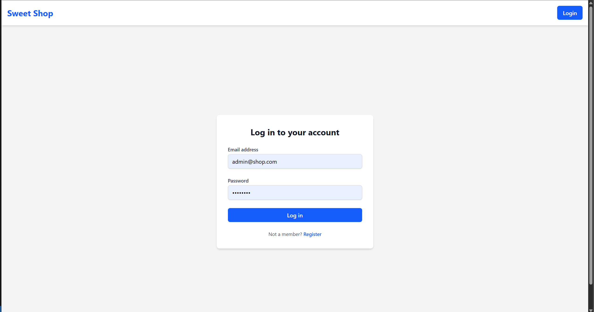
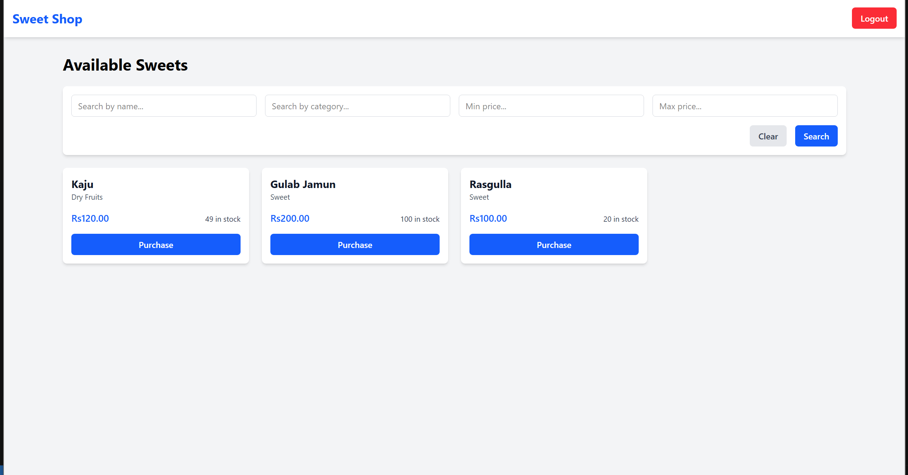
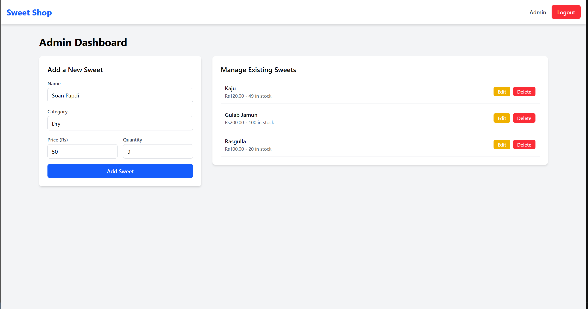
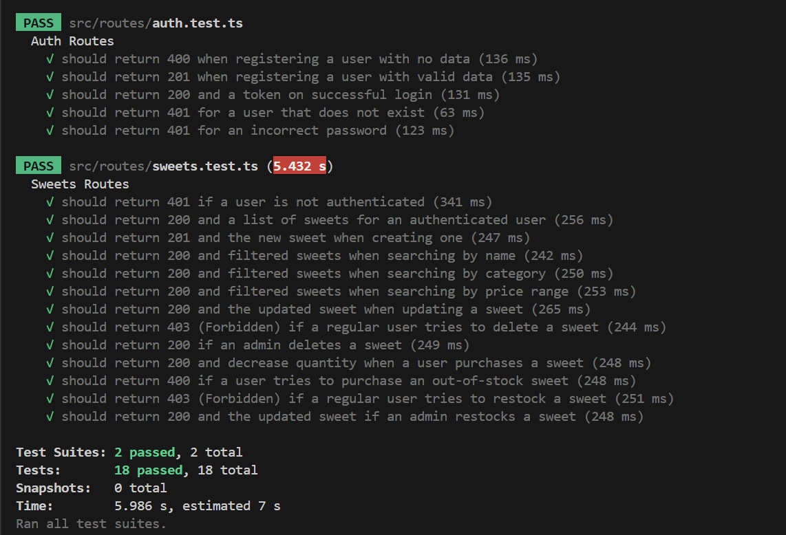

# Sweet Shop Management System

This is a full-stack MERN (MongoDB, Express, React, Node.js) application built as a technical assignment. The project is a complete management system for a sweet shop, featuring user authentication, inventory management, and a separate admin panel for managing stock.

The backend is built following a strict **Test-Driven Development (TDD)** methodology, with a comprehensive test suite covering all API endpoints.

## 🌐 Live Demo

Visit the live application at: [Sweet Shop Management System](https://sweet-shop-management-client-eight.vercel.app/login)

## 📸 Screenshots





## ✨ Features

- **User Authentication:** Secure user registration and login with JSON Web Tokens (JWT)
- **Product Dashboard:** A public-facing view of all available sweets
- **Search & Filter:** Users can search sweets by name, category, and price range
- **Inventory Management:** Users can "purchase" sweets, which decrements stock
- **Admin Panel:** A protected admin-only section for:
  - Adding new sweets
  - Updating existing sweets (price, quantity, etc.)
  - Deleting sweets from the shop
  - Restocking inventory

## 🛠️ Tech Stack

- **Monorepo:** Managed with `npm workspaces`
- **Backend:**
  - **Node.js** with **Express**
  - **TypeScript**
  - **MongoDB** with **Mongoose** (for database)
  - **JWT** (for authentication)
  - **bcrypt.js** (for password hashing)
- **Testing (Backend):**
  - **Jest** (Test Runner)
  - **Supertest** (API Request Simulation)
  - **mongodb-memory-server** (In-memory database for testing)
- **Frontend:**
  - **React** with **Vite**
  - **TypeScript**
  - **React Router** (for client-side routing)
  - **Tailwind CSS** (for styling)
  - **Axios** (for API calls)
  - **React Context** (for global state management)

## 🚀 How to Set Up and Run Locally

Follow these instructions to get the project running on your local machine.

### Prerequisites

- [Node.js](https://nodejs.org/en) (v18 or later)
- [Git](https://git-scm.com/)
- A **MongoDB Atlas** account (you need a free cluster)

### 1. Clone the Repository

```bash
git clone https://github.com/mudit-dixit/sweet-shop-management.git
cd sweet-shop-management
```

### 2. Install Dependencies

This is a monorepo, so you only need to run `npm install` from the root directory.

```bash
npm install
```

### 3. Set Up Environment Variables

Create a `.env` file in the `packages/server` directory with the following variables:

```env
MONGODB_URI=your_mongodb_atlas_connection_string
JWT_SECRET=your_jwt_secret_key
```

Replace `your_mongodb_atlas_connection_string` and `your_jwt_secret_key` with your actual MongoDB connection string and a secret key for JWT.

### 4. Run the Application

```bash
npm run dev -w api     # Start the backend server
npm run dev -w client  # Start the frontend dev server
```

This will start both the backend server and the frontend development server:
- Backend: http://localhost:5000
- Frontend: http://localhost:5173

### 5. Create an Admin User (Required)

1. Open the app in your browser (http://localhost:5173)
2. Go to the Register page
3. Create a new user (e.g., admin@shop.com, admin123)
4. Log in to your MongoDB Atlas account and "Browse Collections"
5. Find the users collection and locate the user you just created
6. Edit their document to change the role field from "USER" to "ADMIN"
7. Save the change - you can now log in as this user to access the Admin panel

### 6. Running Tests (Backend)

```bash
npm run test -w api
```
    
### Test Results (Screenshot)

(Run the command above and take a screenshot of the final output, like the one below, then drag-and-drop it here.)




## 🤖 My AI Usage

As per the assignment's AI policy, I used an AI assistant (Google's Gemini) as a co-author and development partner. Here is a summary of how I leveraged AI in this project:

- **Boilerplate Generation:** Generated initial boilerplate code for Express server, React components, and Jest test files
- **TDD Guidance:** Used AI as a pair programmer for TDD workflow, generating "RED" (failing) tests for new features
- **Debugging:** Got explanations and solutions for error messages and test failures
- **Configuration:** Received help with configuration files and environment issues
- **Refactoring:** Got assistance in refactoring code to follow best practices

### My Reflection

Using an AI assistant was like having a senior developer available 24/7. It didn't write the app for me, but it handled the repetitive setup, caught my typos, and provided instant feedback on my code. This allowed me to focus on the logic (like the TDD cycle and API design) rather than getting stuck on syntax or configuration. It significantly sped up my workflow.